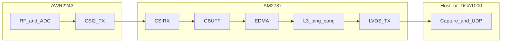

# AM273x Cascade LVDS CLI — System Documentation

This document is the authoritative reference for the **AM273x + AWR2243** cascade radar firmware variant under `am273x_LVDS_CLI/`. It consolidates architecture, data-path behavior, host interface (UART CLI), and the operational policies implemented to deliver **reliable, byte-aligned LVDS output** to a DCA1000 or equivalent capture path.

---

## 1. Purpose and scope

The application:

- Configures the mmWave front end (AWR2243 cascade) through the TI mmWave control stack.
- Receives high-rate ADC payloads on the AM273x **MIPI CSI-2** receivers (dual CSIRX instances).
- Moves data through **CBUFF** and **EDMA** into on-chip memory, then streams it over **LVDS** for external recording.
- Exposes a **line-oriented UART CLI** for repeatable lab configuration without recompiling.

The firmware incorporates **startup-frame protection** so that known-unstable early RF frames do not appear in the LVDS byte stream used for host-side synchronization. It also separates **RF frame progression** from optional **geometry logging**, including support for **finite** and **continuous (infinite) RF** modes where applicable.

---

## 2. High-level data flow

Data moves from the sensor through the SoC and off-chip as follows:

**Ping–pong reception:** CSIRX fills alternating line buffers. On each **end-of-line (EOL)** interrupt on the master port, firmware updates DMA source selection and issues CBUFF software triggers so completed lines are forwarded toward LVDS without CPU memcpy of the full chirp payload.

---

## 3. Software architecture

### 3.1 Primary source files

| Component | Path | Role |
|-----------|------|------|
| Application / CLI / test harness | [`am273x/main_mss.c`](am273x/main_mss.c) | FreeRTOS tasks, UART CLI, mmWave start/stop, LVDS session setup, capture monitoring, diagnostics |
| CSI-2 path, EOL/EOF ISRs, geometry | [`am273x/cascade_csirx.c`](am273x/cascade_csirx.c) | CSIRX callbacks, CBUFF activation/trigger, per-frame bookkeeping |
| CSI / geometry declarations | [`am273x/cascade_csirx.h`](am273x/cascade_csirx.h) | Types, `CHIRP_GEOM_MAX_FRAMES`, externs |
| CLI configuration structs | [`am273x/app_cli_state.h`](am273x/app_cli_state.h) | `CLI_CaptureConfig`, `gCfg` / `gActive` |
| LVDS / CBUFF session glue | [`am273x/cascade_lvds_stream.c`](am273x/cascade_lvds_stream.c) / [`.h`](am273x/cascade_lvds_stream.h) | Session and EDMA channel setup |

### 3.2 Event chain (per chirp line, master port)

On each CSI-2 line completion, the master **combined EOL** callback runs:

1. **Startup protection (if enabled):** While the current RF frame index is inside the configured discard window, the firmware advances ping–pong tracking only (`skipTransfer`) and **does not** activate CBUFF, reconfigure EDMA sources for transmit, or assert CBUFF software trigger bits. No LVDS payload is emitted for those lines.
2. **First transmitted line:** `CBUFF_activateSession` (session arm).
3. **Subsequent lines:** `configureTransfer` (ping/pong source select) and CBUFF register triggers for chirp/frame advance, subject to the existing busy guard when enabled.

**End of frame (EOF)** on the master port finalizes per-frame geometry (when configured), then advances the **master RF frame index** exactly once. That index drives both discard exit and consistency with host byte counting.

---

## 4. Startup-frame protection and RF modes

### 4.1 Rationale

Empirical work on this platform showed **concentrated chirp loss on the earliest frames** of a capture (CSI-2 / link bring-up region), while later frames can reach nominal chirp counts. Receiver timing and HSI delay experiments did not remove that startup pattern. The product response is **operational protection**: run additional internal RF frames at the front of a capture and **withhold LVDS payload** until a configured number of master frames have completed, so the host’s **byte-count-based framing** aligns with stable data.

### 4.2 Finite capture (default product model)

- User configures a **valid** frame count **M** (the number of frames intended for downstream processing).
- Optional **`startupDiscardFrames` = N** discards the first **N** RF frames at the EOL decision point (no CBUFF/LVDS emission for those lines).
- The control path extends the mmWave **internal** frame count to **M + N** so the sensor still executes **M** useful frames after the discard window.
- End-of-run diagnostics validate trigger counts, software completion counts, and payload bytes against **M × chirps_per_frame** (and related invariants).

### 4.3 Continuous RF (`numFrames == 0`)

When the latched configuration keeps **`numFrames == 0`**, the firmware treats RF generation as **continuous**: no finite EOF target loop, and **no M+N inflation** (discard does not convert infinite mode into a short finite run).

Startup discard still applies: the first **N** master frames suppress LVDS triggers; thereafter triggers continue for every subsequent line for the life of the session.

**Configuration note:** The UART parser for `frameCfg` currently rejects `frames == 0`, and `setFrames` accepts only **1..65535**. Selecting continuous mode from the CLI therefore requires allowing zero in the relevant command handler (for example `frameCfg` or `setFrames`) if your deployment needs runtime infinite capture without rebuilding defaults.

### 4.4 Master RF frame index (single source of truth)

Firmware maintains **`gMasterRfFrameIdx`**, advanced **once per master EOF** after finalizing the closed frame. During all EOL callbacks belonging to physical RF frame **k**, the visible index equals **k**; after EOF for frame **k**, it becomes **k + 1**.

**Discard gating**, **first transmitted frame index** latching, and any “current RF frame” semantics use **only** this counter. A separate legacy alias mirrors its low 16 bits for UART-friendly dumps and must not be used for discard decisions.

### 4.5 Finite geometry capacity (`M + N > 256`)

Per-frame geometry RAM is capped by **`CHIRP_GEOM_MAX_FRAMES` (256)**. If **M + N** exceeds that cap, **discard and LVDS behavior remain correct** because the master index continues to advance; only **optional** per-slot geometry writes stop once the linear capacity is exhausted. This is **intentional** and not treated as a regression of streaming correctness.

---

## 5. Geometry and observability

### 5.1 Finite mode

Up to **`min(M + N, 256)`** linear slots record expected vs observed EOL counts and timing metadata per RF frame. These records support post-capture UART summaries (`[GEOM-SUMMARY]`, `[GEOM]`).

### 5.2 Continuous mode

A **256-entry ring** overwrites the geometry array by **`logicalFrameIdx % 256`**, while each slot stores the full **`logicalFrameIdx`** for disambiguation in logs. This provides recent history without unbounded RAM and **does not** influence discard logic.

### 5.3 Chirp identification

In ADC-only CSI-2 mode, line payloads do not carry a software-visible chirp index inside the CSIRX buffer. Geometry reports **counts and timing per frame**, not which chirp indices were lost inside a frame.

---

## 6. Diagnostics and validation

### 6.1 Finite capture

After a normal completion, logs include port deltas, CBUFF trigger vs `swFrameDone` alignment, byte totals, and **`[DISCARD]`** lines when discard is enabled: requested valid frames, startup discard count, internal target, expected vs actual triggers/bytes, first transmitted frame index, and leak counters.

### 6.2 Continuous capture

There is no natural end-of-run summary and no periodic UART heartbeat during capture; the monitor task sleeps in a loop until an external stop path is used (no `[HB]` / `[HB-INF]` lines).

---

## 7. UART CLI reference

Commands are **case-sensitive**, one line per command, terminated by **`\n`**. Floating-point arguments are converted to hardware units inside the parser.

### 7.1 `sensorStart`

Latches `gCfg` into `gActive`, validates buffer geometry, applies startup-discard policy (finite vs continuous), and transitions the application state machine toward capture.

- **Finite:** JSON includes `"infinite":0`, `validFrames`, `startupDiscard`, `internalFrames` (after any M+N inflation).
- **Continuous:** JSON includes `"infinite":1` and `startupDiscard` only.

### 7.2 `status`

JSON snapshot of CLI state, masks, frame profile fields, and derived chirps-per-frame and byte estimates.

### 7.3 `setFrames <N>`

Sets `frame.numFrames`. **Valid range: 1..65535** (zero is not accepted here; see §4.3).

### 7.4 `frameCfg <startIdx> <endIdx> <loops> <frames> <periodicity_ms> <triggerSel> <delay_ms>`

Seven arguments required. **`loops`** and **`frames`** must be **> 0** in the current parser. Period and delay are interpreted in **milliseconds** and scaled to 5 ns LSBs for the device.

### 7.5 `channelCfg <rxMask_hex> <txMask_hex>`

`rxMask`: **1..0xFF**. `txMask`: **1..0x3F**.

### 7.6 `setTDM <0|1>`

Enables or disables TDM-style scaling of **chirps per frame** in derived geometry (`chirps_per_frame = (tdm ? popcount(txMask) : 1) * numLoops`).

### 7.7 `setChirpHeader <0|1>`

Selects whether a small software header is prepended per chirp in the LVDS software session path.

### 7.8 `adcCfg <bits> <fmt>`

**bits:** `0` = 12, `1` = 14, `2` = 16. **fmt:** `0` real, `1` complex 1x, `2` complex 2x. Updates `frame.numAdcSamples` consistently with the profile for complex modes.

### 7.9 `profileCfg`

Fourteen floating-point arguments in the order documented in TI mmWave demo conventions (frequency in GHz, times in µs, slope in MHz/µs, `numAdcSamples`, `digOutSampleRate` in ksps, etc.). See [`main_mss.c`](am273x/main_mss.c) `profileCfg` handler for exact mapping.

### 7.10 `setStartupDiscard <N>`

**N** in **0..50**. **0** disables startup protection.

- **Finite captures:** **`N` must be strictly less than** the user frame count **M** (`frame.numFrames` **before** `sensorStart` inflation).
- **Continuous capture:** only the **0..50** bound applies; no comparison against `numFrames`.

---

## 8. Empirical background (CSI-2 link behavior)

Historical characterization on this stack (dual CSIRX, Port 0 driving CBUFF) showed:

- **Startup region:** Fewer EOL events than expected per frame immediately after session start.
- **Mid-capture region:** Often a stable, repeatable shortfall vs nominal chirps per frame, with **no** CBUFF skip counter inflation, **no** FIFO overflow flags, and **no** Complex I/O error accumulation on the logged runs.
- **Mirror ports:** Port 0 and Port 1 EOL totals matched, indicating loss or classification effects aligned with the CSI receiver path rather than asymmetric CPU handling.

Hypotheses involving extra CQ packets, IRQ starvation, and coarse frame-delay tuning were ruled out or weakened by measurement. The **engineering mitigation** adopted in firmware is **startup discard plus explicit frame indexing**, preserving a deterministic relationship between **RF frame boundaries** and **LVDS byte cadence** for the frames the host is intended to parse.

---

## 9. Build and integration

This tree is part of the TI mmWave MCU+ SDK layout. Build using the TI CCS / SysConfig flow for the **AM273x** MSS target associated with this example. Ensure driver-generated files under `am273x/mssgenerated/` match your silicon and board.

